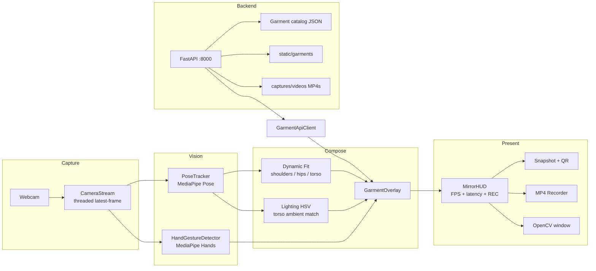

# VTO Smart Mirror

**AI-powered virtual try-on for in-store fashion retail.** A live webcam becomes a smart mirror: MediaPipe body tracking, PNG garment compositing, gesture browsing, and a FastAPI catalog — so shoppers preview shirts (and optional pants) without a fitting room.

Built as a production-style computer-vision portfolio project: real-time overlay, retail HUD, QR share, H.264 MP4 session recording, and on-screen performance metrics.

---

## Project Architecture

The desktop client runs a 1280×720 capture loop. A FastAPI backend serves the garment catalog and static assets. Phones on the same LAN download snapshots from `/captures`.



| Layer | Role |
| --- | --- |
| `main.py` | Live loop: camera, pose, gestures, overlay, HUD, snapshot, recording |
| `core/camera.py` | Non-blocking grabber so pose work cannot stall the device buffer |
| `core/tracker.py` | MediaPipe Pose Landmarker → shoulder, hip, and ankle measurements |
| `core/overlay.py` | EMA-smoothed garment placement, color variants, upper/full outfit |
| `core/garment_overlay.py` | Dynamic sizing, alpha feathering, HSV lighting and recolor |
| `core/gesture_detector.py` | Index-finger swipe left/right + fingertip cursor |
| `core/ui_overlay.py` | Retail HUD, FPS/latency, blinking REC badge, AI Fit Advisor |
| `core/snapshot.py` | PNG snapshots + H.264 MP4 session recorder |
| `core/qr_generator.py` | LAN download URL + QR overlay after a snapshot |
| `backend/app` | FastAPI catalog API, static garments, capture hosting |

---

## Key Features

### Dynamic Fit
Shirt width follows shoulder span; length follows shoulder-to-hip torso height (with PNG aspect-ratio clamps so the garment does not stretch unnaturally). In **full outfit** mode, jeans scale from hip width and hip-to-ankle length. EMA smoothing keeps the overlay stable when hands enter the frame or pose briefly drops.

### Lighting HSV
A chest patch is sampled each frame. Median HSV **value** estimates ambient brightness; the garment BGR is gain/contrast-matched so fabric does not look pasted on under bright or dim store lighting. Color variants (Crimson, Royal, Emerald, Charcoal) recolor in HSV while preserving texture and alpha.

### Gesture Control
MediaPipe Hands tracks the index fingertip (EMA-smoothed cursor on the mirror). A short horizontal swipe left/right cycles the shirt catalog — the same actions as `P` / `N`. Designed for kiosk use without touching a keyboard.

### AI Fit Advisor
Shoulder-to-torso **ratio** (distance-invariant) is mapped to S / M / L. A short vote window plus smoothed confidence produce a stable HUD line such as `Size M - 94% Fit Match`, instead of flickering every frame.

### QR Code Share
`S` starts a 3–2–1 **CHEESE!** countdown. The composed try-on PNG is written asynchronously, a QR code of `http://<LAN-IP>:8000/captures/<file>` is shown for six seconds, and a phone on the same Wi-Fi can download the look.

### Session recording & performance HUD
`R` is a clean toggle: first press starts recording (`is_recording = True`), second press stops, releases the writer, and writes `captures/videos/vto_recording_TIMESTAMP.mp4` (H.264 `h264` / `avc1`). While recording, a blinking red **● REC 00:XX** badge sits on the top-right HUD. After stop, a **VIDEO SAVED!** toast appears for 2 seconds. The status pill reports **FPS** and **frame inference latency (ms)**.

---

## Setup Instructions

### Requirements
- Python 3.10+ (64-bit)
- Webcam
- Windows, macOS, or Linux (DirectShow is used automatically on Windows)

### 1. Clone and install

```bash
git clone <your-repo-url> vto-smart-mirror
cd vto-smart-mirror
python -m venv .venv
```

**Windows (PowerShell)**

```powershell
.\.venv\Scripts\Activate.ps1
pip install -r requirements.txt
```

**macOS / Linux**

```bash
source .venv/bin/activate
pip install -r requirements.txt
```

On first pose run, MediaPipe downloads `pose_landmarker.task` (one-time).

### 2. Start the catalog API

From the `backend` folder so FastAPI can import `app`:

```bash
cd backend
uvicorn app.main:app --host 0.0.0.0 --port 8000 --reload
```

Confirm [http://127.0.0.1:8000/health](http://127.0.0.1:8000/health). Garments are served from `backend/static/garments/` and seeded from `assets/sample_clothes/`.

### 3. Launch the Smart Mirror

From the **project root** (second terminal, venv active):

```bash
python main.py
```

Stand about 1.5–2.5 m from the camera, shoulders visible. If the API is down, the client falls back to local PNGs in `assets/sample_clothes/`. Keep the API running if you want phones to fetch snapshot URLs.

### Sample catalog layout

```
assets/sample_clothes/
  tshirts/     # upper garments (PNG with transparency)
  pants/       # optional jeans for full-outfit mode
```

---

## Keyboard Controls Guide

Focus the OpenCV window, then:

| Key | Action |
| --- | --- |
| **N** | Next shirt (also **swipe right**) |
| **P** | Previous shirt (also **swipe left**) |
| **O** | Toggle **Upper only** / **Full outfit** (shirt + pants when a lower asset exists) |
| **C** | Cycle color: Original → Crimson Red → Royal Blue → Emerald Green → Charcoal |
| **S** | Snapshot countdown (3–2–1 CHEESE!), then QR download overlay |
| **R** | Start / stop live MP4 recording of the mirror output |
| **Q** | Quit and release the camera (open recordings are finalized) |

### On-screen HUD
- **Top bar** — garment name, category, size tag, price, color swatches
- **Top-right** — `LIVE TRY-ON \| {FPS} FPS \| {ms}` and, while recording, blinking **● REC MM:SS**
- **Below bar** — AI Fit Advisor (left) and outfit mode chip (right)
- **Swipe hints** — `Swipe L` / `Swipe R` on the top bar

Recordings: `captures/videos/vto_recording_<timestamp>.mp4`  
Snapshots: `captures/VTO_TryOn_<timestamp>.png` (API path `/captures/<file>`)

---

## Tech Stack

- **OpenCV** — capture, compositing, HUD, VideoWriter (`h264` / `avc1` MP4)
- **MediaPipe** — Pose Landmarker + Hands
- **NumPy** — measurements, alpha blend, HSV lighting
- **FastAPI + Uvicorn** — catalog REST API and static files
- **qrcode + Pillow** — snapshot share codes

---

## Project Structure

```
vto-smart-mirror/
├── main.py                      # Smart Mirror entry point
├── requirements.txt
├── assets/sample_clothes/       # Local PNG catalog
├── captures/                    # Snapshot PNGs + videos/
│   └── videos/                  # Session MP4 recordings
├── config/settings.py
├── core/                        # Vision, overlay, HUD, recording
└── backend/
    ├── app/                     # FastAPI app + catalog router
    └── static/garments/         # API-served clothing assets
```

---

## Notes for reviewers

This is a **real-time 2D overlay** system (pose-driven PNG compositing), not a 3D cloth sim. Fit advice uses body *proportions*, not a tape-measure reconstruction. Inference latency on the HUD is the pose + gesture + overlay cost for that frame, not GPU FLOPs.

Typical laptop target: interactive FPS with the latency pill in the tens of milliseconds, depending on CPU and camera lighting.
